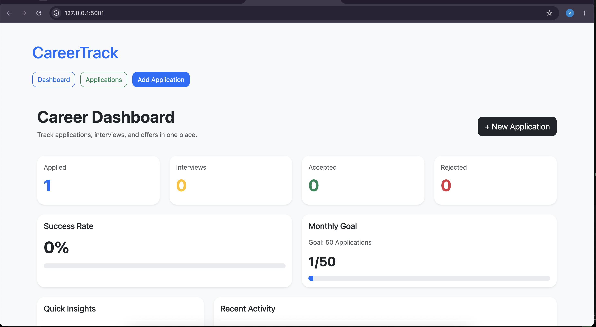
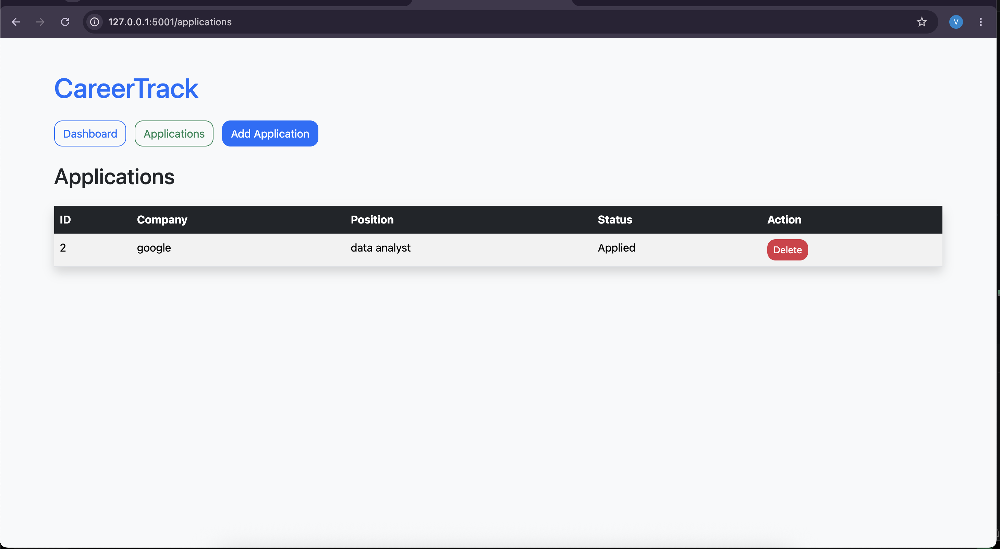
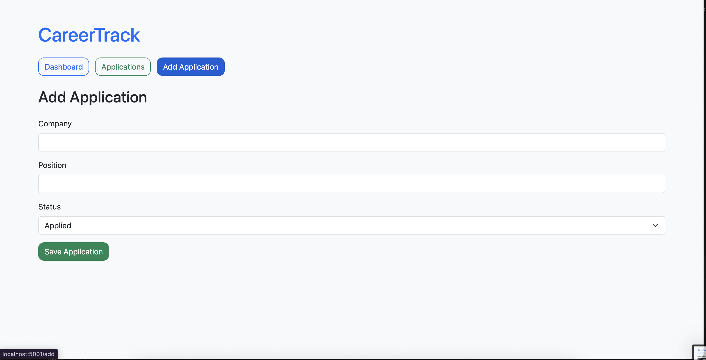

# CareerTrack – Job Application Tracking System

## Project Overview

CareerTrack is a web-based job application tracking system developed using Flask and SQLite. The application helps users organize and monitor their job search process by allowing them to add, view, and manage job applications from a centralized dashboard.

The system provides insights into application progress, interview opportunities, acceptance rates, and overall job search performance through an interactive dashboard.


## Objectives

The primary objectives of this project are:

- Track job applications efficiently
- Monitor application status throughout the recruitment process
- Visualize application statistics through a dashboard
- Demonstrate CRUD operations using Flask and SQLite
- Implement a responsive and user-friendly interface
- Containerize the application using Docker


## Features

### Dashboard
- Total applications count
- Applied applications count
- Interview applications count
- Accepted applications count
- Rejected applications count
- Success rate calculation
- Monthly application goal tracker
- Recent activity section

### Application Management
- Add new job applications
- View all applications
- Delete applications
- Track application status

### Status Categories
- Applied
- Interview
- Accepted
- Rejected

### Technical Features
- SQLite database integration
- Dynamic HTML rendering with Jinja2
- Responsive Bootstrap interface
- Docker containerization


## Technologies Used

| Technology | Purpose |
|------------|----------|
| Python | Backend Development |
| Flask | Web Framework |
| SQLite | Database Management |
| HTML5 | Structure |
| CSS3 | Styling |
| Bootstrap 5 | Responsive UI |
| Jinja2 | Template Engine |
| Docker | Containerization |


## System Architecture

```text
User
  |
  v
Flask Application
  |
  +---- Dashboard
  |
  +---- Add Application
  |
  +---- View Applications
  |
  +---- Delete Application
  |
  v
SQLite Database
```


## Project Structure

```text
CareerTrack/
│
├── app.py
├── database.py
├── database.db
├── requirements.txt
├── Dockerfile
├── README.md
│
├── templates/
│   ├── base.html
│   ├── dashboard.html
│   ├── applications.html
│   └── add_application.html
│
└── static/
```


## Database Design

### Table: applications

| Field | Data Type | Description |
|---------|----------|-------------|
| id | INTEGER | Primary Key |
| company | TEXT | Company Name |
| position | TEXT | Job Position |
| status | TEXT | Application Status |

---

## Installation Guide

### Step 1: Clone the Repository

```bash
git clone https://github.com/your-username/CareerTrack.git
cd CareerTrack
```

### Step 2: Create Virtual Environment

```bash
python -m venv venv
```

### Activate Environment

Mac/Linux:

```bash
source venv/bin/activate
```

Windows:

```bash
venv\Scripts\activate
```

### Step 3: Install Dependencies

```bash
pip install -r requirements.txt
```

### Step 4: Create Database

```bash
python database.py
```

### Step 5: Run Application

```bash
python app.py
```

### Access Application

```text
http://localhost:5001
```


## Docker Containerization

This project has been containerized using Docker.

### Build Docker Image

```bash
docker build -t careertrack .
```

### Run Docker Container

```bash
docker run --rm -p 5001:5000 careertrack
```

### Access Application

```text
http://localhost:5001
```


## CRUD Operations Implemented

| Operation | Description |
|------------|-------------|
| Create | Add new application |
| Read | View applications |
| Update | Status tracking |
| Delete | Remove application |


## Sample Workflow

1. Open CareerTrack Dashboard
2. Add a new job application
3. Select application status
4. Save application
5. View applications list
6. Track progress through dashboard metrics
7. Delete applications when required


## Challenges Faced

- Designing an intuitive dashboard interface
- Managing SQLite database operations
- Implementing dynamic Flask routing
- Docker container configuration
- Port conflict resolution during deployment


## Future Enhancements

- User Authentication and Authorization
- Resume Upload Feature
- Email Notifications
- Application Editing Functionality
- Interview Scheduling
- Data Visualization Charts
- Cloud Deployment (AWS, Azure, Render)
- Multi-user Support

---

## Learning Outcomes

Through this project, the following concepts were learned and implemented:

- Flask Web Development
- Routing and Templates
- SQLite Database Integration
- CRUD Operations
- Bootstrap UI Design
- Docker Containerization
- Project Structure and Organization
- Full-Stack Development Fundamentals


## Screenshots

### Dashboard


### Applications Page


### Add Application Page



## Declaration

This project was developed for academic purposes as part of coursework requirements and demonstrates the practical implementation of web development concepts using Flask, SQLite, Bootstrap, and Docker.